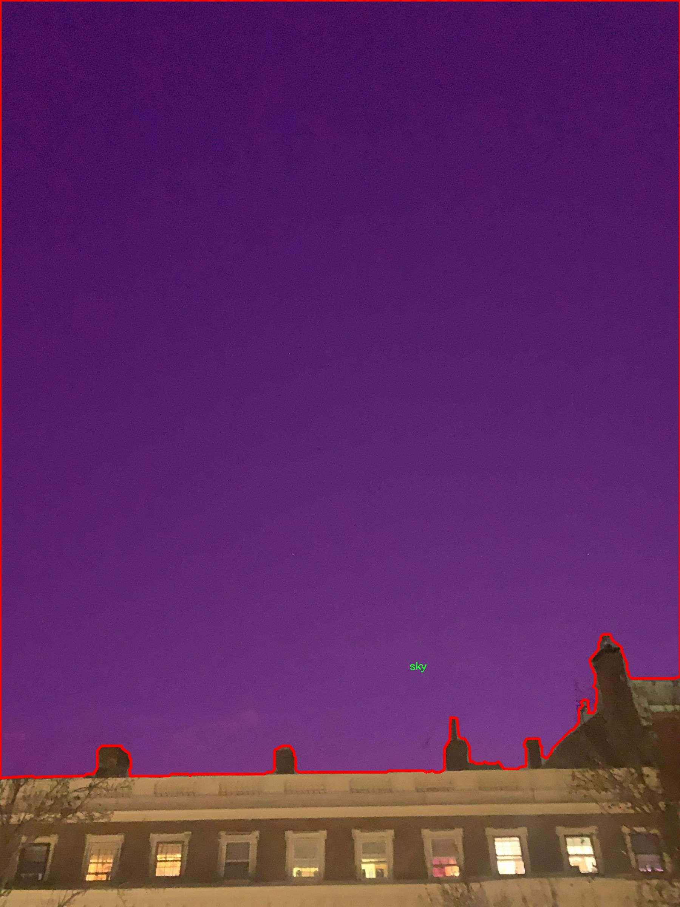

### 1.背景意义

研究背景与意义

随着计算机视觉技术的迅速发展，实例分割在图像处理和分析领域中的应用愈发广泛。尤其是在夜间环境下，天空的实例分割面临着诸多挑战，如光照不足、噪声干扰和复杂的背景等。夜间天空的图像处理不仅在天文学、气象学等科学研究中具有重要意义，还在无人驾驶、监控系统等实际应用中扮演着关键角色。因此，开发一种高效的夜间天空实例分割系统，能够显著提升相关领域的研究和应用水平。

本研究基于改进的YOLOv11模型，旨在解决夜间天空实例分割中的诸多难题。我们使用了名为“NoisySky”的数据集，该数据集包含1300幅夜间天空图像，经过精确标注，专注于天空这一单一类别。尽管该数据集的类别数量较少，但其在夜间条件下的图像多样性和复杂性为模型的训练提供了良好的基础。通过对这些图像的分析，我们可以深入理解夜间天空的特征，并利用YOLOv11的高效检测能力，提升实例分割的准确性和鲁棒性。

此外，夜间天空的实例分割不仅可以帮助我们更好地理解和分析天体运动、气象变化等自然现象，还可以为智能交通、环境监测等领域提供数据支持。通过对夜间天空的有效分割，相关系统能够更准确地识别和分析环境变化，为决策提供科学依据。因此，本研究不仅具有理论价值，也具备广泛的应用前景，期待能够为夜间计算机视觉领域的进一步发展贡献力量。

### 2.视频效果

[2.1 视频效果](https://www.bilibili.com/video/BV1jakFYgEwM/)

### 3.图片效果


##### [项目涉及的源码数据来源链接](https://kdocs.cn/l/cszuIiCKVNis)**

注意：本项目提供训练的数据集和训练教程,由于版本持续更新,暂不提供权重文件（best.pt）,请按照6.训练教程进行训练后实现上图演示的效果。

### 4.数据集信息

##### 4.1 本项目数据集类别数＆类别名

nc: 1
names: ['sky']


该项目为【图像分割】数据集，请在【训练教程和Web端加载模型教程（第三步）】这一步的时候按照【图像分割】部分的教程来训练

##### 4.2 本项目数据集信息介绍

本项目数据集信息介绍

本项目旨在改进YOLOv11的夜间天空实例分割系统，所使用的数据集名为“NoisySky”。该数据集专注于夜间天空的图像，旨在为模型提供丰富的训练样本，以提升其在低光照环境下的识别和分割能力。NoisySky数据集包含多样化的夜空图像，涵盖了不同的天气条件、光污染程度以及星空的自然变化。这些图像不仅展现了夜空的美丽，也包含了多种噪声因素，如光斑、云层和城市灯光等，这些都为模型的训练提供了极具挑战性的场景。

在类别方面，NoisySky数据集设定了单一类别，即“sky”。这一设计使得模型能够专注于识别和分割夜空的特征，减少了类别间的干扰，从而提高了实例分割的精度。尽管类别数量有限，但通过对不同类型夜空图像的多样化采集，数据集确保了模型在面对各种夜空条件时的适应性和鲁棒性。

为了增强数据集的实用性，NoisySky还包含了标注信息，确保每张图像中的天空区域都被准确标识。这一过程不仅提高了数据集的质量，也为后续的模型训练提供了可靠的基础。通过对这些夜间天空图像的深入分析和学习，改进后的YOLOv11系统将能够更有效地处理夜间环境中的实例分割任务，为天文观测、城市规划及环境监测等领域提供重要的技术支持。





### 5.全套项目环境部署视频教程（零基础手把手教学）

[5.1 所需软件PyCharm和Anaconda安装教程（第一步）](https://www.bilibili.com/video/BV1BoC1YCEKi/?spm_id_from=333.999.0.0&vd_source=bc9aec86d164b67a7004b996143742dc)


[5.2 安装Python虚拟环境创建和依赖库安装视频教程（第二步）](https://www.bilibili.com/video/BV1ZoC1YCEBw?spm_id_from=333.788.videopod.sections&vd_source=bc9aec86d164b67a7004b996143742dc)

### 6.改进YOLOv11训练教程和Web_UI前端加载模型教程（零基础手把手教学）

[6.1 改进YOLOv11训练教程和Web_UI前端加载模型教程（第三步）](https://www.bilibili.com/video/BV1BoC1YCEhR?spm_id_from=333.788.videopod.sections&vd_source=bc9aec86d164b67a7004b996143742dc)


按照上面的训练视频教程链接加载项目提供的数据集，运行train.py即可开始训练



     Epoch   gpu_mem       box       obj       cls    labels  img_size
     1/200     20.8G   0.01576   0.01955  0.007536        22      1280: 100%|██████████| 849/849 [14:42<00:00,  1.04s/it]
               Class     Images     Labels          P          R     mAP@.5 mAP@.5:.95: 100%|██████████| 213/213 [01:14<00:00,  2.87it/s]
                 all       3395      17314      0.994      0.957      0.0957      0.0843

     Epoch   gpu_mem       box       obj       cls    labels  img_size
     2/200     20.8G   0.01578   0.01923  0.007006        22      1280: 100%|██████████| 849/849 [14:44<00:00,  1.04s/it]
               Class     Images     Labels          P          R     mAP@.5 mAP@.5:.95: 100%|██████████| 213/213 [01:12<00:00,  2.95it/s]
                 all       3395      17314      0.996      0.956      0.0957      0.0845

     Epoch   gpu_mem       box       obj       cls    labels  img_size
     3/200     20.8G   0.01561    0.0191  0.006895        27      1280: 100%|██████████| 849/849 [10:56<00:00,  1.29it/s]
               Class     Images     Labels          P          R     mAP@.5 mAP@.5:.95: 100%|███████   | 187/213 [00:52<00:00,  4.04it/s]
                 all       3395      17314      0.996      0.957      0.0957      0.0845


###### [项目数据集下载链接](https://kdocs.cn/l/cszuIiCKVNis)

### 7.原始YOLOv11算法讲解

YOLO11采用改进的骨干和颈部架构，增强了特征提取能力，提高了物体检测的精确度和复杂任务的表现。YOLO11引入精炼的架构设计和优化的训练流程，实现更快的处理速度，同时保持精度和性能之间的最佳平衡。通过模型设计的进步，YOLO11m在COCO数据集上实现了更高的均值平均精度（mAP），同时使用比YOLOv8m少22%的参数，使其在不妥协准确性的情况下更加计算高效。YOLO11可以无缝部署在各种环境中，包括边缘设备、云平台以及支持NVIDIA
GPU的系统，确保最大灵活性。无论是物体检测、实例分割、图像分类、姿态估计，还是定向物体检测（OBB），YOLO11都旨在应对多样的计算机视觉挑战。


##### **Ultralytics YOLO11相比于之前版本的主要改进有哪些？**

Ultralytics YOLO11在其前身基础上引入了几项重要进步。主要改进包括：

  1. **增强的特征提取** ：YOLO11采用改进的骨干和颈部架构，增强了特征提取能力，提高了物体检测的精确度。
  2.  **优化的效率和速度** ：精炼的架构设计和优化的训练流程实现了更快的处理速度，同时保持了准确性和性能之间的平衡。
  3.  **更高的准确性与更少的参数** ：YOLO11m在COCO数据集上实现了更高的均值平均精度（mAP），同时使用比YOLOv8m少22%的参数，使其在不妥协准确性的情况下更加计算高效。
  4.  **环境适应性强** ：YOLO11可以在多种环境中部署，包括边缘设备、云平台以及支持NVIDIA GPU的系统。
  5.  **支持广泛的任务** ：YOLO11支持多种计算机视觉任务，如物体检测、实例分割、图像分类、姿态估计和定向物体检测（OBB）。

我们先来看一下其网络结构有什么变化，可以看出，相比较于YOLOv8模型，其将CF2模块改成C3K2，同时在SPPF模块后面添加了一个C2PSA模块，且将YOLOv10的head思想引入到YOLO11的head中，使用深度可分离的方法，减少冗余计算，提高效率。下面我们来详细看一下这两个模块的结构是怎么构成的，以及它们为什么要这样设计


##### C3K2的网络结构

从下面图中我们可以看到，C3K2模块其实就是C2F模块转变出来的，它代码中有一个设置，就是当c3k这个参数为FALSE的时候，C3K2模块就是C2F模块，也就是说它的Bottleneck是普通的Bottleneck；反之当它为true的时候，将Bottleneck模块替换成C3模块。


##### C2PSA的网络结构

` `C2PSA是对 `C2f` 模块的扩展，它结合了PSA(Pointwise Spatial
Attention)块，用于增强特征提取和注意力机制。通过在标准 `C2f` 模块中引入 PSA
块，C2PSA实现了更强大的注意力机制，从而提高了模型对重要特征的捕捉能力。


##### **C2f 模块回顾：**

**** C2f模块是一个更快的 CSP（Cross Stage Partial）瓶颈实现，它通过两个卷积层和多个 Bottleneck
块进行特征提取。相比传统的 CSPNet，C2f 优化了瓶颈层的结构，使得计算速度更快。在 C2f中，`cv1` 是第一个 1x1
卷积，用于减少通道数；`cv2` 是另一个 1x1 卷积，用于恢复输出通道数。而 `n` 是一个包含 Bottleneck 块的数量，用于提取特征。

##### **C2PSA 模块的增强** ：

**C2PSA** 扩展了 C2f，通过引入PSA( **Position-Sensitive Attention)**
，旨在通过多头注意力机制和前馈神经网络来增强特征提取能力。它可以选择性地添加残差结构（shortcut）以优化梯度传播和网络训练效果。同时，使用FFN
可以将输入特征映射到更高维的空间，捕获输入特征的复杂非线性关系，允许模型学习更丰富的特征表示。

##### head部分

YOLO11在head部分的cls分支上使用深度可分离卷积 ，具体代码如下，cv2边界框回归分支，cv3分类分支。

    
    
     self.cv2 = nn.ModuleList(
                nn.Sequential(Conv(x, c2, 3), Conv(c2, c2, 3), nn.Conv2d(c2, 4 * self.reg_max, 1)) for x in ch
            )
            self.cv3 = nn.ModuleList(
                nn.Sequential(
                    nn.Sequential(DWConv(x, x, 3), Conv(x, c3, 1)),
                    nn.Sequential(DWConv(c3, c3, 3), Conv(c3, c3, 1)),
                    nn.Conv2d(c3, self.nc, 1),
                )
                for x in ch
            )


### 8.200+种全套改进YOLOV11创新点原理讲解

#### 8.1 200+种全套改进YOLOV11创新点原理讲解大全

由于篇幅限制，每个创新点的具体原理讲解就不全部展开，具体见下列网址中的改进模块对应项目的技术原理博客网址【Blog】（创新点均为模块化搭建，原理适配YOLOv5~YOLOv11等各种版本）

[改进模块技术原理博客【Blog】网址链接](https://gitee.com/qunmasj/good)


#### 8.2 精选部分改进YOLOV11创新点原理讲解

###### 这里节选部分改进创新点展开原理讲解(完整的改进原理见上图和[改进模块技术原理博客链接](https://gitee.com/qunmasj/good)【如果此小节的图加载失败可以通过CSDN或者Github搜索该博客的标题访问原始博客，原始博客图片显示正常】


### OREPA：在线卷积重参数化
卷积神经网络(CNNs)已经在许多计算机视觉任务的应用成功，包括图像分类、目标检测、语义分割等。精度和模型效率之间的权衡也已被广泛讨论。

一般来说，一个精度较高的模型通常需要一个更复杂的块，一个更宽或更深的结构。然而，这样的模型总是太重，无法部署，特别是在硬件性能有限、需要实时推理的场景下。考虑到效率，更小、更紧凑和更快的模型自然是首选。

为了获得一个部署友好且高精度的模型，有研究者提出了基于结构重参数化的方法来释放性能。在这些方法中，模型在训练阶段和推理阶段有不同的结构。具体来说，使用复杂的训练阶段拓扑，即重参数化的块，来提高性能。训练结束后，通过等效变换将一个复杂的块重参为成一个单一的线性层。重参后的模型通常具有一个整洁架构模型，例如，通常是一个类似VGG的或一个类似ResNet的结构。从这个角度来看，重参化策略可以在不引入额外的推理时间成本的情况下提高模型的性能。


BN层是重构模型的关键组成部分。在一个重新解析块(图1(b))中，在每个卷积层之后立即添加一个BN层。可以观察到，去除这些BN层会导致的性能退化。然而，当考虑到效率时，这种BN层的使用出乎意料地在训练阶段带来了巨大的计算开销。在推理阶段，复杂的块可以被压缩成一个卷积层。但是，在训练过程中，BN层是非线性的，也就是说，它们将特征映射除以它的标准差，这就阻止了合并整个块。因此，存在大量的中间计算操作(large FLOPS)和缓冲特征映射(high memory usage)。更糟糕的是，这么高的训练预算使得很难探索更复杂和可能更强的重参块。很自然地，下面的问题就出现了：

为什么标准化在重参中这么重要？

通过分析和实验，作者认为BN层中的尺度因子最重要，因为它们能够使不同分支的优化方向多样化。

基于观察结果，作者提出了在线重参化(OREPA)(图1(c))，这是一个两阶段的pipeline，使之能够简化复杂的training-time re-param block。

在第一阶段，block linearization，去除所有的非线性BN层，并引入线性缩放层。这些层与BN层具有相似的性质，因此它们使不同分支的优化多样化。此外，这些层都是线性的，可以在训练过程中合并成卷积层。

第二阶段，block squeezing，将复杂的线性块简化为单一的卷积层。OREPA通过减少由中间计算层引起的计算和存储开销，显著降低了训练成本，对性能只有非常小的影响。

此外，高效化使得探索更复杂的重参化拓扑成为可能。为了验证这一点，作者进一步提出了几个重参化的组件，以获得更好的性能。

在ImageNet分类任务上评估了所提出的OREPA。与最先进的修复模型相比，OREPA将额外的训练时间GPU内存成本降低了65%到75%，并将训练过程加快了1.5-2.3倍。同时，OREPA-ResNet和OREPA-VGG的性能始终优于+0.2%∼+0.6%之前的DBB和RepVGG方法。同时作者还评估了在下游任务上的OREPA，即目标检测和语义分割。作者发现OREPA可以在这些任务上也可以带来性能的提高。

提出了在线卷积重参化(OREPA)策略，这极大地提高了重参化模型的训练效率，并使探索更强的重参化块成为可能；

通过对重参化模型工作机制的分析，用引入的线性尺度层代替BN层，这仍然提供了不同的优化方向，并保持了表示能力;

在各种视觉任务上的实验表明，OREPA在准确性和训练效率方面都优于以前的重参化模型(DBB/RepVGG)。


#### 结构重参化
结构重参化最近被重视并应用于许多计算机视觉任务，如紧凑模型设计、架构搜索和剪枝。重参化意味着不同的架构可以通过参数的等价转换来相互转换。例如，1×1卷积的一个分支和3×3卷积的一个分支，可以转移到3×3卷积的单个分支中。在训练阶段，设计了多分支和多层拓扑来取代普通的线性层(如conv或全连接层)来增强模型。Cao等讨论了如何在训练过程中合并深度可分离卷积核。然后在推理过程中，将训练时间的复杂模型转移到简单模型中，以便于更快的推理。

在受益于复杂的training-time拓扑，同时，当前的重参化方法训练使用不可忽略的额外计算成本。当块变得更复杂以变得更强的表示时，GPU内存利用率和训练时间将会越来越长，最终走向不可接受。与以往的重参化方法不同，本文更多地关注训练成本。提出了一种通用的在线卷积重参化策略，使training-time的结构重参化成为可能。


#### Normalization
BN被提出来缓解训练非常深度神经网络时的梯度消失问题。人们认为BN层是非常重要的，因为它们平滑了损失。最近关于无BN神经网络的研究声称，BN层并不是不可或缺的。通过良好的初始化和适当的正则化，可以优雅地去除BN层。

对于重参化模型，作者认为重参化块中的BN层是关键的。无BN的变体将会出现性能下降。然而，BN层是非线性的，也就是说，它们将特征图除以它的标准差，这阻止了在线合并块。为了使在线重参化可行，作者去掉了重参块中的所有BN层，并引入了BN层的线性替代方法，即线性缩放层。

#### 卷积分解
标准卷积层计算比较密集，导致大的FLOPs和参数量。因此，卷积分解方法被提出，并广泛应用于移动设备的轻量化模型中。重参化方法也可以看作是卷积分解的某种形式，但它更倾向于更复杂的拓扑结构。本文的方法的不同之处在于，在kernel-level上分解卷积，而不是在structure level。

#### 在线重参化
在本节中，首先，分析了关键组件，即重参化模型中的BN层，在此基础上提出了在线重参化(OREPA)，旨在大大减少再参数化模型的训练时间预算。OREPA能够将复杂的训练时间块简化为一个卷积层，并保持了较高的精度。

OREPA的整体pipeline如图所示，它包括一个Block Linearization阶段和一个Block Squeezing阶段。


参考该博客通过分析多层和多分支结构的优化多样性，深入研究了重参化的有效性，并证明了所提出的线性缩放层和BN层具有相似的效果。

最后，随着训练预算的减少，进一步探索了更多的组件，以实现更强的重参化模型，成本略有增加。

#### 重参化中的Normalization
作者认为中间BN层是重参化过程中多层和多分支结构的关键组成部分。以SoTA模型DBB和RepVGG为例，去除这些层会导致严重的性能下降，如表1所示。


这种观察结果也得到了Ding等人的实验支持。因此，作者认为中间的BN层对于重参化模型的性能是必不可少的。

然而，中间BN层的使用带来了更高的训练预算。作者注意到，在推理阶段，重参化块中的所有中间操作都是线性的，因此可以合并成一个卷积层，从而形成一个简单的结构。

但在训练过程中，BN层是非线性的，即它们将特征映射除以其标准差。因此，中间操作应该单独计算，这将导致更高的计算和内存成本。更糟糕的是，如此高的成本将阻止探索更强大的训练模块。

#### Block Linearization
如3.1中所述，中间的BN层阻止了在训练过程中合并单独的层。然而，由于性能问题，直接删除它们并不简单。为了解决这一困境，作者引入了channel级线性尺度操作作为BN的线性替代方法。

缩放层包含一个可学习的向量，它在通道维度中缩放特征映射。线性缩放层具有与BN层相似的效果，它们都促进多分支向不同的方向进行优化，这是重参化时性能提高的关键。除了对性能的影响外，线性缩放层还可以在训练过程中进行合并，使在线重参化成为可能。


基于线性缩放层，作者修改了重参化块，如图所示。具体来说，块的线性化阶段由以下3个步骤组成：

首先，删除了所有的非线性层，即重参化块中的BN层

其次，为了保持优化的多样性，在每个分支的末尾添加了一个缩放层，这是BN的线性替代方法

最后，为了稳定训练过程，在所有分支的添加后添加一个BN层。

一旦完成线性化阶段，在重参化块中只存在线性层，这意味着可以在训练阶段合并块中的所有组件。

#### Block Squeezing
Block Squeezing步骤将计算和内存昂贵的中间特征映射上的操作转换为更经济的kernel上的操作。这意味着在计算和内存方面从减少到，其中、是特征图和卷积核的空间尺寸。

一般来说，无论线性重参化块是多么复杂，以下2个属性始终成立：

Block中的所有线性层，例如深度卷积、平均池化和所提出的线性缩放，都可以用带有相应参数的退化卷积层来表示;

Block可以由一系列并行分支表示，每个分支由一系列卷积层组成。

有了上述两个特性，如果可以将

多层（即顺序结构）

多分支（即并行结构）

简化为单一卷积，就可以压缩一个块。在下面的部分中，将展示如何简化顺序结构(图(a))和并行结构(图(b))。


### 9.系统功能展示

图9.1.系统支持检测结果表格显示

  图9.2.系统支持置信度和IOU阈值手动调节

  图9.3.系统支持自定义加载权重文件best.pt(需要你通过步骤5中训练获得)

  图9.4.系统支持摄像头实时识别

  图9.5.系统支持图片识别

  图9.6.系统支持视频识别

  图9.7.系统支持识别结果文件自动保存

  图9.8.系统支持Excel导出检测结果数据


### 10. YOLOv11核心改进源码讲解

#### 10.1 mamba_yolo.py

以下是对代码中最核心部分的提取和详细注释。代码主要涉及深度学习中的模块定义，尤其是与选择性扫描（Selective Scan）和深度学习模型的构建相关的部分。

```python
import torch
import torch.nn as nn
from einops import rearrange

class LayerNorm2d(nn.Module):
    """二维层归一化类"""
    def __init__(self, normalized_shape, eps=1e-6, elementwise_affine=True):
        super().__init__()
        self.norm = nn.LayerNorm(normalized_shape, eps, elementwise_affine)

    def forward(self, x):
        # 将输入的形状从 (B, C, H, W) 转换为 (B, H, W, C)
        x = rearrange(x, 'b c h w -> b h w c').contiguous()
        x = self.norm(x)  # 进行层归一化
        # 再将形状转换回 (B, C, H, W)
        x = rearrange(x, 'b h w c -> b c h w').contiguous()
        return x

class CrossScan(torch.autograd.Function):
    """交叉扫描功能类"""
    @staticmethod
    def forward(ctx, x: torch.Tensor):
        B, C, H, W = x.shape
        ctx.shape = (B, C, H, W)
        xs = x.new_empty((B, 4, C, H * W))  # 创建一个新的张量
        xs[:, 0] = x.flatten(2, 3)  # 将 x 展平
        xs[:, 1] = x.transpose(dim0=2, dim1=3).flatten(2, 3)  # 转置并展平
        xs[:, 2:4] = torch.flip(xs[:, 0:2], dims=[-1])  # 翻转
        return xs

    @staticmethod
    def backward(ctx, ys: torch.Tensor):
        B, C, H, W = ctx.shape
        L = H * W
        # 反向传播
        ys = ys[:, 0:2] + ys[:, 2:4].flip(dims=[-1]).view(B, 2, -1, L)
        y = ys[:, 0] + ys[:, 1].view(B, -1, W, H).transpose(dim0=2, dim1=3).contiguous().view(B, -1, L)
        return y.view(B, -1, H, W)

class SelectiveScanCore(torch.autograd.Function):
    """选择性扫描核心功能类"""
    @staticmethod
    @torch.cuda.amp.custom_fwd
    def forward(ctx, u, delta, A, B, C, D=None, delta_bias=None, delta_softplus=False, nrows=1, backnrows=1):
        # 确保输入张量是连续的
        if u.stride(-1) != 1:
            u = u.contiguous()
        if delta.stride(-1) != 1:
            delta = delta.contiguous()
        if D is not None and D.stride(-1) != 1:
            D = D.contiguous()
        if B.stride(-1) != 1:
            B = B.contiguous()
        if C.stride(-1) != 1:
            C = C.contiguous()
        
        # 保存输入以供反向传播使用
        ctx.save_for_backward(u, delta, A, B, C, D, delta_bias)
        # 调用 CUDA 核心实现
        out, x, *rest = selective_scan_cuda_core.fwd(u, delta, A, B, C, D, delta_bias, delta_softplus, 1)
        return out

    @staticmethod
    @torch.cuda.amp.custom_bwd
    def backward(ctx, dout):
        u, delta, A, B, C, D, delta_bias = ctx.saved_tensors
        # 调用 CUDA 核心实现进行反向传播
        du, ddelta, dA, dB, dC, dD, ddelta_bias = selective_scan_cuda_core.bwd(
            u, delta, A, B, C, D, delta_bias, dout
        )
        return (du, ddelta, dA, dB, dC, dD, ddelta_bias, None, None, None, None)

def cross_selective_scan(x: torch.Tensor, x_proj_weight: torch.Tensor, dt_projs_weight: torch.Tensor, A_logs: torch.Tensor, Ds: torch.Tensor, out_norm: nn.Module = None):
    """交叉选择性扫描函数"""
    B, D, H, W = x.shape
    L = H * W

    # 进行交叉扫描
    xs = CrossScan.apply(x)

    # 计算投影
    x_dbl = torch.einsum("b k d l, k c d -> b k c l", xs, x_proj_weight)
    dts, Bs, Cs = torch.split(x_dbl, [R, N, N], dim=2)

    # 计算 HiPPO 矩阵
    As = -torch.exp(A_logs.to(torch.float))  # (k * c, d_state)
    Ds = Ds.to(torch.float)  # (K * c)

    # 调用选择性扫描
    ys: torch.Tensor = SelectiveScan.apply(xs, dts, As, Bs, Cs, Ds)
    y: torch.Tensor = CrossMerge.apply(ys)

    # 进行输出归一化
    if out_norm is not None:
        y = out_norm(y)

    return y

class SS2D(nn.Module):
    """SS2D 模块"""
    def __init__(self, d_model=96, d_state=16, ssm_ratio=2.0, act_layer=nn.SiLU):
        super().__init__()
        self.in_proj = nn.Conv2d(d_model, d_model * ssm_ratio, kernel_size=1)  # 输入投影
        self.out_proj = nn.Conv2d(d_model * ssm_ratio, d_model, kernel_size=1)  # 输出投影
        self.act = act_layer()  # 激活函数

    def forward(self, x: torch.Tensor):
        x = self.in_proj(x)  # 投影
        x = self.act(x)  # 激活
        x = self.out_proj(x)  # 输出
        return x

class VSSBlock_YOLO(nn.Module):
    """VSSBlock YOLO 模块"""
    def __init__(self, in_channels: int, hidden_dim: int):
        super().__init__()
        self.proj_conv = nn.Conv2d(in_channels, hidden_dim, kernel_size=1)  # 投影卷积
        self.ss2d = SS2D(d_model=hidden_dim)  # SS2D 模块

    def forward(self, input: torch.Tensor):
        input = self.proj_conv(input)  # 投影
        x = self.ss2d(input)  # 通过 SS2D 模块
        return x
```

### 核心部分分析
1. **LayerNorm2d**: 实现了二维层归一化，用于深度学习模型中的特征标准化。
2. **CrossScan**: 实现了交叉扫描的前向和反向传播，主要用于特征的交叉处理。
3. **SelectiveScanCore**: 选择性扫描的核心实现，利用 CUDA 加速前向和反向传播。
4. **cross_selective_scan**: 结合交叉扫描和选择性扫描的函数，完成输入的特征处理。
5. **SS2D**: 实现了一个简单的模块，包含输入投影、激活和输出投影。
6. **VSSBlock_YOLO**: YOLO 模型中的一个模块，结合了投影卷积和 SS2D 模块。

这些模块和功能是构建深度学习模型的基础，特别是在处理图像数据时，能够有效地提取和处理特征。

这个文件 `mamba_yolo.py` 实现了一个基于深度学习的模型，主要用于计算机视觉任务，尤其是目标检测。代码中使用了 PyTorch 框架，并结合了一些高效的操作来提高模型的性能。以下是对文件中主要内容的逐步分析。

首先，文件导入了一些必要的库，包括 `torch`、`math`、`functools` 和 `torch.nn`，这些都是构建神经网络所需的基础组件。接着，定义了一些自定义的模块和函数，例如 `LayerNorm2d`，它是一个二维的层归一化模块，用于对输入的特征图进行归一化处理。

接下来，定义了几个辅助函数和类，包括 `autopad` 用于自动计算填充量，`CrossScan` 和 `CrossMerge` 用于实现交叉扫描和合并操作。这些操作在处理特征图时，可以有效地捕捉空间信息和上下文信息。

`SelectiveScanCore` 类实现了选择性扫描的核心功能，这是一个自定义的自动求导函数，支持前向和反向传播。选择性扫描是一种高效的计算方法，能够在处理序列数据时减少计算量。

`cross_selective_scan` 函数则封装了选择性扫描的具体实现，接受多个输入参数并返回处理后的特征图。这个函数在模型的前向传播中起着重要作用。

`SS2D` 类是一个重要的模块，负责实现特定的状态空间模型（SSM）。它包含多个参数和层，包括输入投影、卷积层、线性层等。这个模块的设计考虑了低秩近似和状态维度的自适应调整，能够在不同的输入条件下保持高效的计算性能。

接下来，定义了一些基本的块，例如 `RGBlock` 和 `LSBlock`，这些块由多个卷积层和激活函数组成，用于构建更复杂的网络结构。`XSSBlock` 和 `VSSBlock_YOLO` 是更高级的模块，结合了前面定义的组件，形成了完整的网络结构。

`SimpleStem` 类是模型的初始部分，负责将输入图像通过一系列卷积和归一化操作进行特征提取。`VisionClueMerge` 类则用于将多个特征图合并，以便在后续的处理阶段使用。

整体来看，这个文件实现了一个复杂的深度学习模型，结合了多种高效的计算方法和模块，旨在提高目标检测任务的性能。通过使用选择性扫描和状态空间模型等技术，模型能够在保持准确性的同时，显著减少计算开销。

#### 10.2 head.py

以下是代码中最核心的部分，保留了主要的检测头类，并添加了详细的中文注释：

```python
import torch
import torch.nn as nn
import torch.nn.functional as F
from ..modules import Conv, DFL, make_anchors, dist2bbox

class Detect_DyHead(nn.Module):
    """YOLOv8 检测头，使用动态头进行目标检测。"""
    
    def __init__(self, nc=80, hidc=256, block_num=2, ch=()):
        """
        初始化检测头的参数。
        
        参数:
        nc (int): 类别数量，默认为80。
        hidc (int): 隐藏层通道数，默认为256。
        block_num (int): 动态头的块数量，默认为2。
        ch (tuple): 输入通道数的元组。
        """
        super().__init__()
        self.nc = nc  # 类别数量
        self.nl = len(ch)  # 检测层数量
        self.reg_max = 16  # DFL通道数
        self.no = nc + self.reg_max * 4  # 每个锚点的输出数量
        self.stride = torch.zeros(self.nl)  # 构建时计算的步幅
        self.conv = nn.ModuleList(nn.Sequential(Conv(x, hidc, 1)) for x in ch)  # 卷积层
        self.dyhead = nn.Sequential(*[DyHeadBlock(hidc) for _ in range(block_num)])  # 动态头块
        self.cv2 = nn.ModuleList(
            nn.Sequential(Conv(hidc, 3, 3), nn.Conv2d(3, 4 * self.reg_max, 1)) for _ in ch
        )  # 用于输出边界框的卷积层
        self.cv3 = nn.ModuleList(
            nn.Sequential(
                nn.Conv2d(hidc, 3, 3),  # 卷积层
                nn.Conv2d(3, self.nc, 1)  # 类别输出卷积层
            )
            for _ in ch
        )
        self.dfl = DFL(self.reg_max) if self.reg_max > 1 else nn.Identity()  # DFL层

    def forward(self, x):
        """前向传播，返回预测的边界框和类别概率。"""
        for i in range(self.nl):
            x[i] = self.conv[i](x[i])  # 通过卷积层处理输入
        x = self.dyhead(x)  # 通过动态头处理
        shape = x[0].shape  # 获取输出形状
        for i in range(self.nl):
            x[i] = torch.cat((self.cv2[i](x[i]), self.cv3[i](x[i])), 1)  # 合并边界框和类别输出
        if self.training:
            return x  # 如果在训练模式，返回输出
        else:
            self.anchors, self.strides = make_anchors(x, self.stride, 0.5)  # 生成锚点和步幅
            x_cat = torch.cat([xi.view(shape[0], self.no, -1) for xi in x], 2)  # 连接输出
            box, cls = x_cat.split((self.reg_max * 4, self.nc), 1)  # 分割边界框和类别
            dbox = dist2bbox(self.dfl(box), self.anchors.unsqueeze(0), xywh=True, dim=1) * self.strides  # 解码边界框
            y = torch.cat((dbox, cls.sigmoid()), 1)  # 合并边界框和类别概率
            return y  # 返回最终输出

    def bias_init(self):
        """初始化检测头的偏置，警告：需要步幅可用。"""
        for a, b, s in zip(self.cv2, self.cv3, self.stride):
            a[-1].bias.data[:] = 1.0  # 边界框偏置
            b[-1].bias.data[:self.nc] = math.log(5 / self.nc / (640 / s) ** 2)  # 类别偏置

# 其他检测头类可以类似地进行简化和注释
```

在这个简化的代码中，保留了 `Detect_DyHead` 类的核心功能，并对其进行了详细的中文注释。可以根据需要进一步添加其他检测头类的实现和注释。

这个程序文件 `head.py` 是一个用于目标检测模型的实现，主要基于 YOLOv8（You Only Look Once v8）架构。文件中定义了多个类和函数，用于构建不同类型的检测头，处理输入特征图并输出预测的边界框和类别概率。

首先，文件导入了一些必要的库，包括 PyTorch 和相关的神经网络模块。这些库提供了构建和训练深度学习模型所需的基础设施。

接下来，文件定义了一系列的检测头类，每个类都继承自 `nn.Module`，这是 PyTorch 中所有神经网络模块的基类。每个检测头类的构造函数通常会接收参数，如类别数量 `nc`、隐藏通道数 `hidc`、特征图通道数 `ch` 等。构造函数中会初始化网络层，包括卷积层、激活函数、归一化层等。

`Detect_DyHead` 类是一个动态头部的实现，使用了动态卷积（DyHead）来提高检测精度。它的 `forward` 方法负责将输入特征图传递通过网络，生成预测的边界框和类别概率。根据训练或推理模式，方法会进行不同的处理。

`Detect_AFPN_P345` 和 `Detect_AFPN_P2345` 类实现了带有自适应特征金字塔网络（AFPN）的检测头，AFPN 通过融合不同层次的特征来提高检测性能。

`Detect_Efficient` 类则实现了一个高效的检测头，使用了轻量级的卷积结构，适合在资源受限的环境中使用。

`DetectAux` 类实现了一个带有辅助头的检测结构，可以在训练时提供额外的监督信号，以提高主检测头的性能。

此外，文件中还定义了一些特定于任务的检测头，如 `Detect_LSCD`、`Detect_LADH`、`Detect_TADDH` 等，这些类在基础检测头的基础上增加了特定的功能或结构，以适应不同的应用场景，比如轻量级检测、姿态估计、旋转边界框检测等。

每个检测头类都有 `bias_init` 方法，用于初始化模型的偏置项，以帮助模型更快地收敛。`decode_bboxes` 方法则用于解码模型输出的边界框，使其适合后续的处理和评估。

总的来说，这个文件实现了多种检测头的结构，能够支持不同的目标检测任务，具有灵活性和可扩展性，适合在实际应用中使用。

#### 10.3 conv.py

以下是经过简化并添加详细中文注释的核心代码部分：

```python
import math
import torch
import torch.nn as nn

def autopad(k, p=None, d=1):
    """自动填充以保持输出形状相同。"""
    if d > 1:
        k = d * (k - 1) + 1 if isinstance(k, int) else [d * (x - 1) + 1 for x in k]  # 实际的卷积核大小
    if p is None:
        p = k // 2 if isinstance(k, int) else [x // 2 for x in k]  # 自动填充
    return p

class Conv(nn.Module):
    """标准卷积层，包含卷积、批归一化和激活函数。"""

    default_act = nn.SiLU()  # 默认激活函数

    def __init__(self, c1, c2, k=1, s=1, p=None, g=1, d=1, act=True):
        """初始化卷积层，参数包括输入通道数、输出通道数、卷积核大小、步幅、填充、分组、扩张和激活函数。"""
        super().__init__()
        self.conv = nn.Conv2d(c1, c2, k, s, autopad(k, p, d), groups=g, dilation=d, bias=False)  # 卷积层
        self.bn = nn.BatchNorm2d(c2)  # 批归一化层
        self.act = self.default_act if act is True else act if isinstance(act, nn.Module) else nn.Identity()  # 激活函数

    def forward(self, x):
        """前向传播：执行卷积、批归一化和激活函数。"""
        return self.act(self.bn(self.conv(x)))

class DWConv(Conv):
    """深度可分离卷积层，继承自标准卷积层。"""

    def __init__(self, c1, c2, k=1, s=1, d=1, act=True):
        """初始化深度卷积层，参数包括输入通道数、输出通道数、卷积核大小、步幅、扩张和激活函数。"""
        super().__init__(c1, c2, k, s, g=math.gcd(c1, c2), d=d, act=act)  # 分组卷积

class DSConv(nn.Module):
    """深度可分离卷积模块。"""
    
    def __init__(self, c1, c2, k=1, s=1, d=1, act=True):
        """初始化深度可分离卷积，包含深度卷积和逐点卷积。"""
        super().__init__()
        self.dwconv = DWConv(c1, c1, 3)  # 深度卷积
        self.pwconv = Conv(c1, c2, 1)  # 逐点卷积

    def forward(self, x):
        """前向传播：执行深度卷积和逐点卷积。"""
        return self.pwconv(self.dwconv(x))

class ConvTranspose(nn.Module):
    """转置卷积层。"""

    default_act = nn.SiLU()  # 默认激活函数

    def __init__(self, c1, c2, k=2, s=2, p=0, bn=True, act=True):
        """初始化转置卷积层，参数包括输入通道数、输出通道数、卷积核大小、步幅、填充、是否使用批归一化和激活函数。"""
        super().__init__()
        self.conv_transpose = nn.ConvTranspose2d(c1, c2, k, s, p, bias=not bn)  # 转置卷积层
        self.bn = nn.BatchNorm2d(c2) if bn else nn.Identity()  # 批归一化层
        self.act = self.default_act if act is True else act if isinstance(act, nn.Module) else nn.Identity()  # 激活函数

    def forward(self, x):
        """前向传播：执行转置卷积、批归一化和激活函数。"""
        return self.act(self.bn(self.conv_transpose(x)))

class ChannelAttention(nn.Module):
    """通道注意力模块。"""

    def __init__(self, channels: int):
        """初始化通道注意力模块，设置池化层和全连接层。"""
        super().__init__()
        self.pool = nn.AdaptiveAvgPool2d(1)  # 自适应平均池化
        self.fc = nn.Conv2d(channels, channels, 1, 1, 0, bias=True)  # 全连接卷积层
        self.act = nn.Sigmoid()  # 激活函数

    def forward(self, x: torch.Tensor) -> torch.Tensor:
        """前向传播：应用通道注意力机制。"""
        return x * self.act(self.fc(self.pool(x)))  # 输入与注意力权重相乘

class CBAM(nn.Module):
    """卷积块注意力模块。"""

    def __init__(self, c1, kernel_size=7):
        """初始化CBAM模块，包含通道注意力和空间注意力。"""
        super().__init__()
        self.channel_attention = ChannelAttention(c1)  # 通道注意力
        self.spatial_attention = SpatialAttention(kernel_size)  # 空间注意力

    def forward(self, x):
        """前向传播：依次应用通道注意力和空间注意力。"""
        return self.spatial_attention(self.channel_attention(x))
```

### 代码说明
1. **autopad**: 自动计算填充，以确保卷积输出的空间维度与输入相同。
2. **Conv**: 标准卷积层，包含卷积、批归一化和激活函数。
3. **DWConv**: 深度卷积层，使用分组卷积以提高效率。
4. **DSConv**: 深度可分离卷积模块，结合深度卷积和逐点卷积。
5. **ConvTranspose**: 转置卷积层，常用于上采样。
6. **ChannelAttention**: 通道注意力机制，通过自适应池化和全连接层生成注意力权重。
7. **CBAM**: 卷积块注意力模块，结合通道和空间注意力机制，增强特征表示能力。

这个程序文件 `conv.py` 定义了一系列用于卷积操作的模块，主要用于深度学习中的卷积神经网络（CNN）。文件中使用了 PyTorch 框架，包含了多个卷积层的实现以及一些注意力机制模块。

首先，文件引入了必要的库，包括 `math`、`numpy` 和 `torch`，并定义了一个名为 `autopad` 的函数，用于根据卷积核的大小、填充和扩张参数自动计算填充量，以确保输出形状与输入形状相同。

接下来，定义了多个卷积类：

1. **Conv**：标准卷积层，包含卷积操作、批归一化和激活函数。激活函数默认为 SiLU（Sigmoid Linear Unit）。在前向传播中，输入经过卷积、批归一化和激活函数处理。

2. **Conv2**：简化的卷积模块，包含一个 1x1 的卷积层和一个标准卷积层的组合。其前向传播将两个卷积的输出相加。

3. **LightConv**：轻量级卷积模块，使用深度卷积（Depth-wise Convolution）和标准卷积的组合。

4. **DWConv**：深度卷积层，使用了标准卷积的结构，但在组数上使用了输入和输出通道数的最大公约数。

5. **DSConv**：深度可分离卷积，结合了深度卷积和逐点卷积（1x1 卷积）。

6. **DWConvTranspose2d**：深度转置卷积层，扩展了 `nn.ConvTranspose2d` 类。

7. **ConvTranspose**：转置卷积层，包含批归一化和激活函数。

8. **Focus**：用于将输入的空间信息聚焦到通道维度的模块，通过对输入进行下采样和拼接，然后通过卷积处理。

9. **GhostConv**：Ghost 卷积模块，结合了主卷积和廉价卷积操作以提高特征学习的效率。

10. **RepConv**：重复卷积模块，支持训练和推理阶段的不同处理，能够将多个卷积层融合为一个。

此外，文件中还定义了几个注意力机制模块：

1. **ChannelAttention**：通道注意力模块，通过全局平均池化和全连接层来计算通道权重。

2. **SpatialAttention**：空间注意力模块，通过对输入的平均和最大值进行卷积来计算空间权重。

3. **CBAM**：卷积块注意力模块，结合了通道注意力和空间注意力。

最后，文件还定义了一个 `Concat` 类，用于在指定维度上连接多个张量。

整体而言，这个文件提供了多种卷积和注意力机制的实现，旨在构建高效的卷积神经网络，适用于目标检测、图像分类等计算机视觉任务。

#### 10.4 rmt.py

以下是代码中最核心的部分，并附上详细的中文注释：

```python
import torch
import torch.nn as nn
import torch.nn.functional as F

class DWConv2d(nn.Module):
    """ 深度可分离卷积类 """
    
    def __init__(self, dim, kernel_size, stride, padding):
        super().__init__()
        # 使用深度可分离卷积，groups=dim表示每个输入通道都有自己的卷积核
        self.conv = nn.Conv2d(dim, dim, kernel_size, stride, padding, groups=dim)

    def forward(self, x: torch.Tensor):
        '''
        x: 输入张量，形状为 (b, h, w, c)
        '''
        x = x.permute(0, 3, 1, 2)  # 转换为 (b, c, h, w)
        x = self.conv(x)  # 进行卷积操作
        x = x.permute(0, 2, 3, 1)  # 转换回 (b, h, w, c)
        return x

class MaSA(nn.Module):
    """ 多头自注意力机制类 """
    
    def __init__(self, embed_dim, num_heads, value_factor=1):
        super().__init__()
        self.factor = value_factor
        self.embed_dim = embed_dim
        self.num_heads = num_heads
        self.head_dim = self.embed_dim * self.factor // num_heads  # 每个头的维度
        self.key_dim = self.embed_dim // num_heads  # 键的维度
        self.scaling = self.key_dim ** -0.5  # 缩放因子
        # 定义线性变换层
        self.q_proj = nn.Linear(embed_dim, embed_dim, bias=True)
        self.k_proj = nn.Linear(embed_dim, embed_dim, bias=True)
        self.v_proj = nn.Linear(embed_dim, embed_dim * self.factor, bias=True)
        self.out_proj = nn.Linear(embed_dim * self.factor, embed_dim, bias=True)
        self.reset_parameters()  # 初始化参数

    def reset_parameters(self):
        # 使用Xavier初始化
        nn.init.xavier_normal_(self.q_proj.weight)
        nn.init.xavier_normal_(self.k_proj.weight)
        nn.init.xavier_normal_(self.v_proj.weight)
        nn.init.xavier_normal_(self.out_proj.weight)

    def forward(self, x: torch.Tensor, rel_pos):
        '''
        x: 输入张量，形状为 (b, h, w, c)
        rel_pos: 位置关系的掩码
        '''
        bsz, h, w, _ = x.size()  # 获取输入的批次大小、高度和宽度

        # 线性变换生成查询、键、值
        q = self.q_proj(x)
        k = self.k_proj(x)
        v = self.v_proj(x)

        # 进行缩放
        k *= self.scaling
        
        # 计算注意力矩阵
        qk_mat = (q @ k.transpose(-1, -2)) + rel_pos  # 添加位置关系
        qk_mat = torch.softmax(qk_mat, dim=-1)  # 归一化

        # 计算输出
        output = torch.matmul(qk_mat, v)  # 加权求和
        output = self.out_proj(output)  # 最后线性变换
        return output

class FeedForwardNetwork(nn.Module):
    """ 前馈神经网络类 """
    
    def __init__(self, embed_dim, ffn_dim, activation_fn=F.gelu, dropout=0.0):
        super().__init__()
        self.fc1 = nn.Linear(embed_dim, ffn_dim)  # 第一层线性变换
        self.fc2 = nn.Linear(ffn_dim, embed_dim)  # 第二层线性变换
        self.dropout = nn.Dropout(dropout)  # dropout层
        self.activation_fn = activation_fn  # 激活函数

    def forward(self, x: torch.Tensor):
        '''
        x: 输入张量，形状为 (b, h, w, c)
        '''
        x = self.fc1(x)  # 第一层
        x = self.activation_fn(x)  # 激活
        x = self.dropout(x)  # dropout
        x = self.fc2(x)  # 第二层
        return x

class VisRetNet(nn.Module):
    """ 视觉回归网络类 """
    
    def __init__(self, in_chans=3, num_classes=1000, embed_dims=[96, 192, 384, 768], depths=[2, 2, 6, 2], num_heads=[3, 6, 12, 24]):
        super().__init__()
        self.patch_embed = PatchEmbed(in_chans=in_chans, embed_dim=embed_dims[0])  # 图像到补丁的嵌入
        self.layers = nn.ModuleList()  # 存储网络层

        # 构建网络层
        for i_layer in range(len(depths)):
            layer = BasicLayer(embed_dim=embed_dims[i_layer], depth=depths[i_layer], num_heads=num_heads[i_layer])
            self.layers.append(layer)

    def forward(self, x):
        x = self.patch_embed(x)  # 进行补丁嵌入
        for layer in self.layers:
            x = layer(x)  # 逐层前向传播
        return x

# 定义补丁嵌入类
class PatchEmbed(nn.Module):
    """ 图像到补丁嵌入 """
    
    def __init__(self, in_chans=3, embed_dim=96):
        super().__init__()
        self.proj = nn.Conv2d(in_chans, embed_dim, kernel_size=4, stride=4)  # 使用卷积进行补丁嵌入

    def forward(self, x):
        x = self.proj(x)  # 进行补丁嵌入
        return x

# 创建模型实例
def RMT_T():
    model = VisRetNet(
        embed_dims=[64, 128, 256, 512],
        depths=[2, 2, 8, 2],
        num_heads=[4, 4, 8, 16]
    )
    return model

if __name__ == '__main__':
    model = RMT_T()  # 创建模型
    inputs = torch.randn((1, 3, 640, 640))  # 随机输入
    res = model(inputs)  # 前向传播
    print(res.size())  # 输出结果的形状
```

### 代码说明：
1. **DWConv2d**：实现了深度可分离卷积，用于减少参数量和计算量。
2. **MaSA**：实现了多头自注意力机制，计算输入的注意力权重并生成输出。
3. **FeedForwardNetwork**：实现了前馈神经网络，包含两层线性变换和激活函数。
4. **VisRetNet**：构建了视觉回归网络，包含多个基本层和补丁嵌入。
5. **PatchEmbed**：将输入图像转换为补丁嵌入，方便后续处理。

该代码实现了一个视觉模型的基础结构，适用于图像分类或其他视觉任务。

这个程序文件 `rmt.py` 实现了一个视觉变换器（Vision Transformer）模型，名为 `VisRetNet`，并提供了不同规模的模型构造函数（如 `RMT_T`, `RMT_S`, `RMT_B`, `RMT_L`）。该模型的设计旨在处理图像数据，使用了一系列模块来实现高效的特征提取和处理。

首先，文件中引入了必要的库，包括 PyTorch 和一些自定义的层。接着定义了一些基本的模块，如 `DWConv2d`（深度可分离卷积）、`RelPos2d`（二维相对位置编码）、`MaSAd` 和 `MaSA`（多头自注意力机制的变体）等。这些模块共同构成了模型的基础。

`DWConv2d` 类实现了深度可分离卷积，通过对输入张量的维度进行转换，应用卷积操作后再转换回原来的维度。`RelPos2d` 类用于生成相对位置编码，支持生成一维和二维的衰减掩码，以便在注意力机制中使用。`MaSAd` 和 `MaSA` 类则实现了多头自注意力机制，能够根据输入的特征图计算注意力权重，并通过线性变换生成输出。

接下来，`FeedForwardNetwork` 类实现了前馈神经网络，包含两个线性层和激活函数，并可选地使用卷积和层归一化。`RetBlock` 类则是一个残差块，结合了注意力机制和前馈网络，并支持层归一化和路径丢弃（DropPath）技术。

`PatchMerging` 类用于将输入特征图进行下采样，`BasicLayer` 类则是一个基本的变换器层，包含多个残差块，并可选地进行下采样。`LayerNorm2d` 类实现了二维层归一化。

`PatchEmbed` 类将输入图像分割成补丁并进行嵌入，`VisRetNet` 类则是整个模型的核心，包含多个层，支持不同的参数配置以适应不同的任务需求。该模型的前向传播方法实现了图像的嵌入、特征提取和输出。

最后，文件中定义了几个函数（`RMT_T`, `RMT_S`, `RMT_B`, `RMT_L`），用于创建不同规模的 `VisRetNet` 模型。每个函数根据预设的参数（如嵌入维度、层数、头数等）构建模型，并返回。

在 `__main__` 部分，示例代码创建了一个小型模型 `RMT_T`，并生成一个随机输入以测试模型的前向传播，最后打印输出特征图的尺寸。这段代码展示了如何使用定义的模型进行推理。

### 11.完整训练+Web前端界面+200+种全套创新点源码、数据集获取


# [下载链接：https://mbd.pub/o/bread/Z5ybk55x](https://mbd.pub/o/bread/Z5ybk55x)